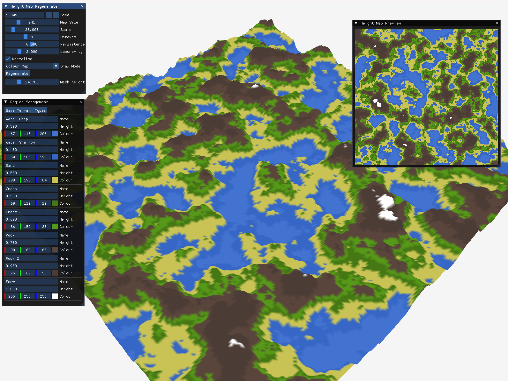
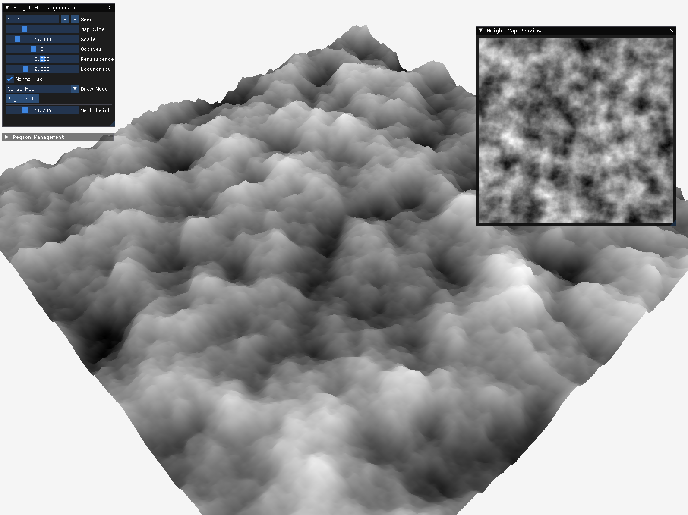

## Terrain Generator

Following [Sebastian Lague's Procedural Landmass Generation](https://www.youtube.com/watch?v=wbpMiKiSKm8&list=PLFt_AvWsXl0eBW2EiBtl_sxmDtSgZBxB3) tutorial, I've implemented it in c++ using Raylib for rendering and ImGui for controls.

### Current Progress




### Building

First run ```vcpkg install``` to grab the dependencies, the repo currently only supports x64-windows for debugging, it should support any other platform but you'll have to create the compiler command yourself.

To build I used the debugger in VSCode, the repo has the task.json and launch.json committed to make this easier for fresh clones. The tasks will create a build folder and copy the currently used dlls to that folder, at the moment only a x64-windows vcpkg triplet is supported as it's hardcoded in some of the paths.


